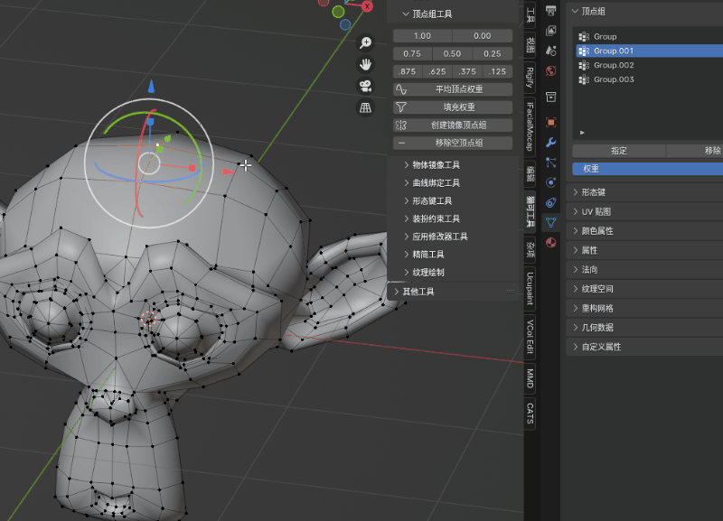
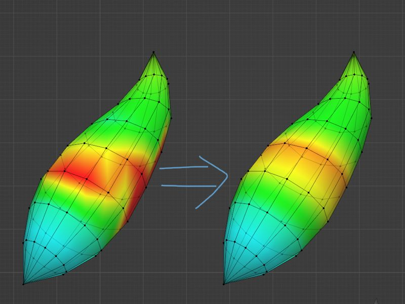

# 顶点组工具

顶点组工具用于在编辑模式下给选定的顶点快速指定权重

## 权重按钮阵列

为在 **编辑模式** 中 **选中** 的顶点, 在 **活动顶点组** 中设置权重, 权重值为按钮上的数值, 0是将顶点直接移除出活动顶点组

## 平均顶点权重

将 **选中** 的顶点在 **全部的顶点组** 中的权重进行平均, 通常用于使有大量循环边的物体 (例如毛发) 在骨架变形时更加平滑

## 创建镜像顶点组

将选中物体的顶点组中名称为 **"XXX.L"** 的, 都对应新建一个 **"XXX.R"** 的 **空顶点组**, 为的是带有 **镜像修改器** 并且 **绑有骨架** 的网格物体, 可以被骨架中对称的骨骼控制, 

> PS: 如果物体同时带有 "XXX.L" 和 "XXX.R" 的顶点组, 其中 "XXX.L" 中有顶点权重数据, "XXX.R" 为空顶点组, 镜像修改器默认会将 "XXX.L" 的顶点组的数据 **镜像同步** 给 "XXX.R"
